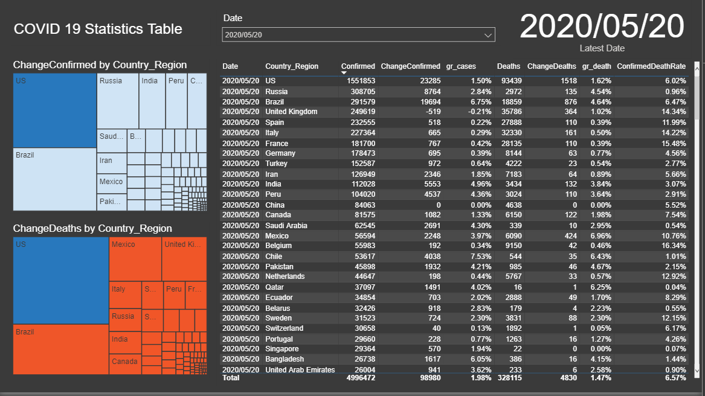
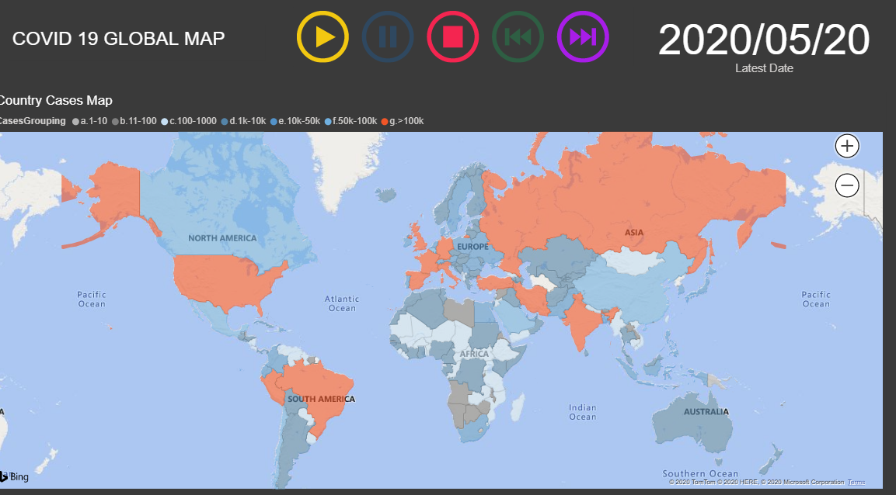
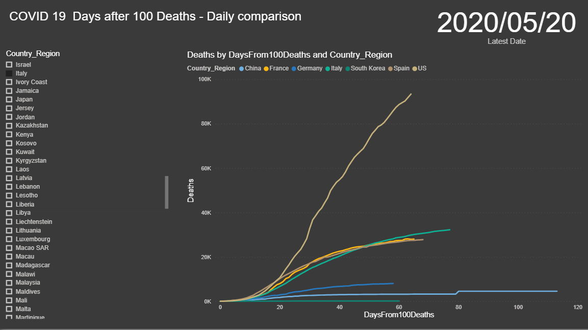
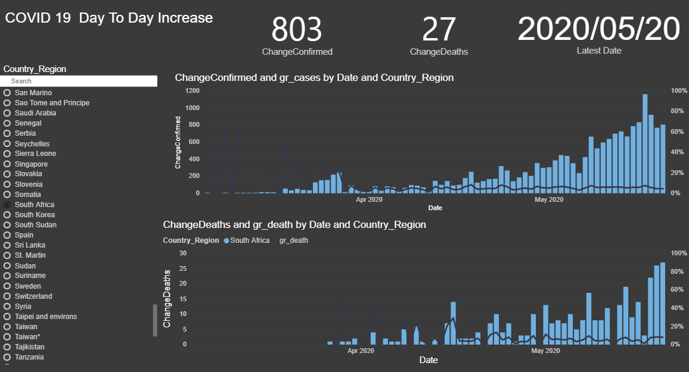

## Covid-19 Power Bi Visualisations

[Back to Project List](http://emilevdheyde.github.io/)

**Project description:** 

This project uses a GitHub Repository with daily data on Covid-19. The Repository is copied and synced on my local drive.
The data is imported and uses Power BI took restructure tables, use DAX to minipulate the data then final display the data. 

### 1. Tabulation Daily 

### 2. Global Map 

### 3. Country Comparison 

### 4. Daily changes For South Africa

 Data Sourced from John Hopkins Github 

Technology used :
Power BI | GitHub

[Back to Project List](http://emilevdheyde.github.io/)

