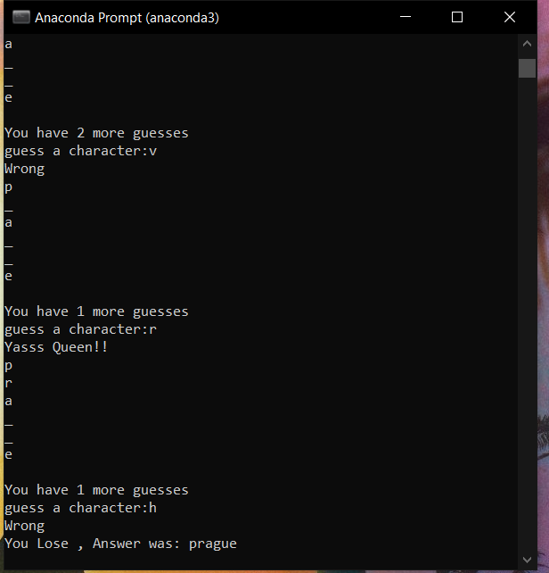

## Covid-19 Power Bi Visualisations

[Back to Project List](http://emilevdheyde.github.io/)

**Project description:** 

This project uses creates a game to guess a word based on 2 categories and alows users to input letters to guess the word 

### 1. Tabulation Daily 

### 2. Global Map 

### 3. Country Comparison 

### 3. Daily changes 

### 4. Video of change

 Data Sourced from John Hopkins Github 

Technology used :
Power BI | GitHub

[Back to Project List](http://emilevdheyde.github.io/)

