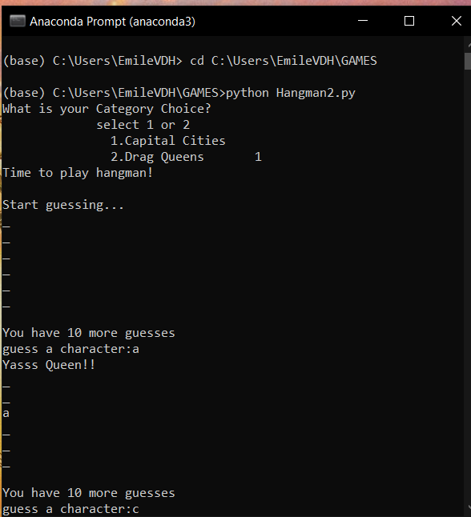
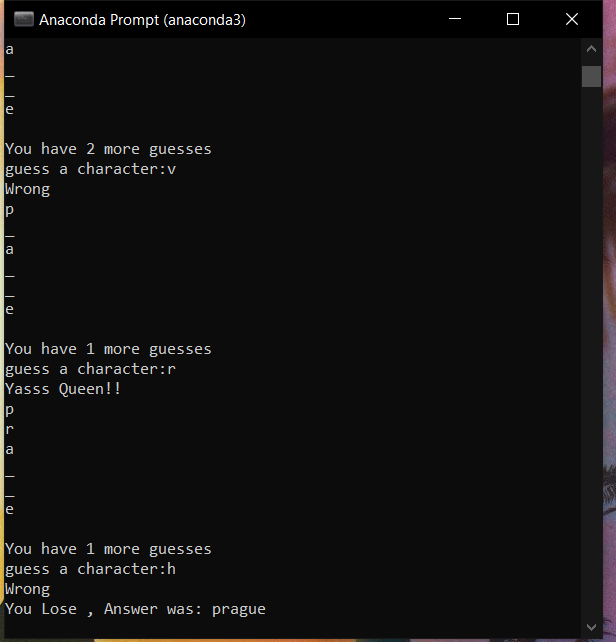

## Hangman Command Line Game

[Back to Project List](http://emilevdheyde.github.io/)

**Project description:** 

This project creates a game to guess a word based on 2 categories and alows users to input letters to guess the word.

[Click here to View .py or .ipynb files relating to this project](https://github.com/EmileVdHeyde/My-Python-Projects/tree/master/2.%20Hangman%20Game)

### 1. Build the list of possible words

Extact with Beautiful soup HTML parser to extract from a wikipedia page the words under each cateory.

### 2. Randomly select the word to guess for the round

Alow the user to select a category and randomly pic a word in this category 

### 3. Build up a Meta data file and store in DataBase

Alow the user to input data and create a merchanism to asses the input using conditional loops

### 3. Extract the actual data 

Run through the HTML per day, to extract the values and store in database 

### 4. Respond to users input 

Respond if user is correct or and respond if incorrect , give the answr once the number of turns have expired

This project was a code improvement of the framework from 
https://www.pythonforbeginners.com/code-snippets-source-code/game-hangman/

Improvements to the code included
>
>
>
>

Packages used :
Beautiful Soup | Pandas | Requests | LMXL | RANDOM | TIME

[Back to Project List](http://emilevdheyde.github.io/)

